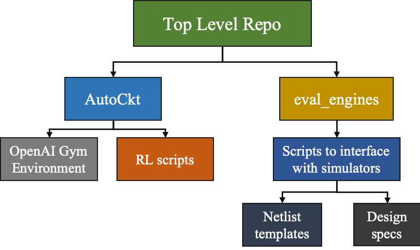

# AutoCkt
Code for [Deep Reinforcement Learning of Analog Circuit Designs](https://arxiv.org/), presented at Design Automation and Test in Europe, 2020. Note that the results shown in the paper include those from NGSpice and Spectre. NGSpice is free and can be installed online (see Setup section). Spectre requires a license, as well as access to the particular technology; the code for this will be open sourced at a later time.

## Setup
This setup requires Anaconda. In order to obtain the required packages, run the command below from the top level directory of the repo to install the Anaconda environment:

```
conda env create -f environment.yml
```

NGspice 2.7 needs to be installed separately, via this [installation link](https://sourceforge.net/projects/ngspice/files/ng-spice-rework/old-releases/27/). Page 607 of the pdf manual on the website has instructions on how to install. Note that you might beed to remove some of the flags to get it to install correctly for your machine. 

## Code Setup
The code is setup in the following way. Starting at top level:




Format: 

The RL agent interacts with the circuit environment to converge to parameters to meet a given design specification. The framework uses:

* Ray RLLIB: an open source tool used to train the RL agent. It implements all of the architectural RL algorithms. The hyperparameter tuning is left to the top level script. 

* OpenAI Gym circuit environment: A custom environment that functions as the agent. It contains information about action space, action steps, reward, done flag, etc. 

* Circuit simulator: we have successfully interfaced AutoCkt with NGSpice, schematic simulations with Spectre and post-layout extracted simulations using the Berkeley Analog Generator and Spectre. In this repo, the code is setup to work for the NGSpice version, as that is commercially available for free. Note that the only thing that changes with a different simulator is the eval\_engine folder.


# How to Run

